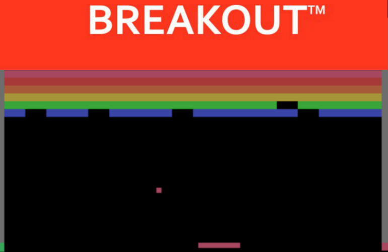

# DeepRL_XIISAC

Projeto de Deep Reinforcement Learning proveniente de um workshop reailizado na Universidade Federal do Ceará durante a semana acadêmica do curso de Computação.

Este projeto implementa uma IA capaz de aprender a jogar Breakout, um famoso jogo de atari.



## Iniciando

Este projeto é realizado utilizando python e outras bibliotecas adicionais.

### Pré-requisitos

**1. Anaconda Python:**
 O pacote pode ser baixado em: https://www.anaconda.com/download/
  
**2. Tensorflow:**
```
conda install tensorflow
```
**3. OpenCV 2:**
```
conda install -c menpo opencv3
```
Obs.: após a instalação do OpenCV, é possível ter um erro referente a uma biblioteca do "libg++.so.5" ou algo do gênero. Para corrigir este possível erro basta utilizar o Anaconda para atualizar sua biblitoeca libgcc:

$ conda install libgcc

**4. Arcade Learning Environment:**

Pode ser instalado seguindo o guia do próprio repositório do projeto no github: https://github.com/mgbellemare/Arcade-Learning-Environment

Você pode testar o ALE ao abrir um terminal Python 3 e executar o comando "from ale_python_interface import ALEInterface"

## Rodando

Basta executar o arquivo *AtariDQN.py* caso todas as instalações estejam corretas.
```
python Atari.DQN.py
```
